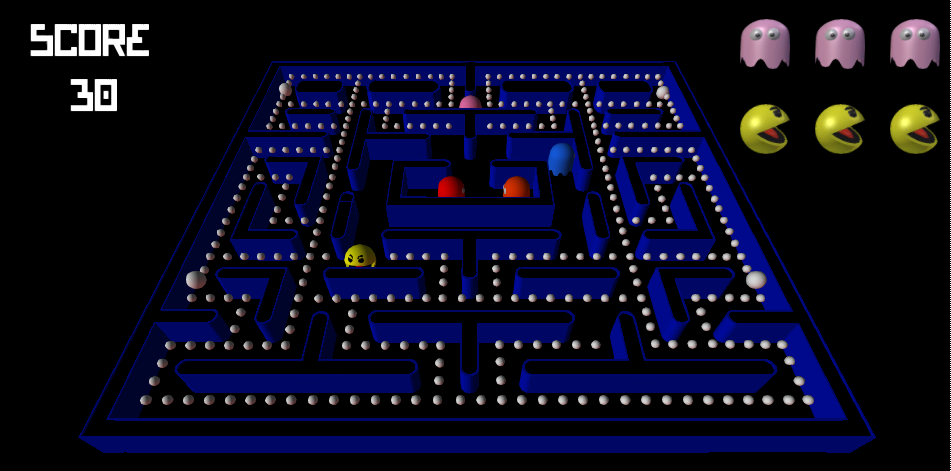
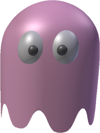

# Ghost-Man

Once upon a time, little Shadow, Speedy, Bashful, Pokey and Pacboy were best friends. They would always play tag together, every day. They had so much fun that they kept playing even growing up. But one of them became very good at it. So good that it attracted people's attention. Pacman got approached by managers and quickly became the most famous tag athlete in the world. But all that fame, all that income made him forget about his friends. He even forgot their names. He became greedy, self-righteous and arrogant, winning every game over and over again. 

Over the years, Shadow, Speedy, Bashful and Pokey have grown tired of it, annoyed, angry. Now, **it has to change!** Help them bring down Pacman. Help them be the best tag players in the history of...tag!

Go, GO! [Bring fairness to this world](http://planteaustudios.github.io/game-off-2013/index.html)! 

# Gameplay

You control Speedy (or Pinky, or Machibusem, or 待ち伏… May we never forget his names!). 

Catch Pacman 3 times to win. The faster you catch him, the lower his score is!

# Controls

Use the   to move around the maze. 

# Credits

[Graham Saulnier](https://github.com/boumbles) – Code

[Eloïse Vignola](https://github.com/Erevu) – Graphics, music
